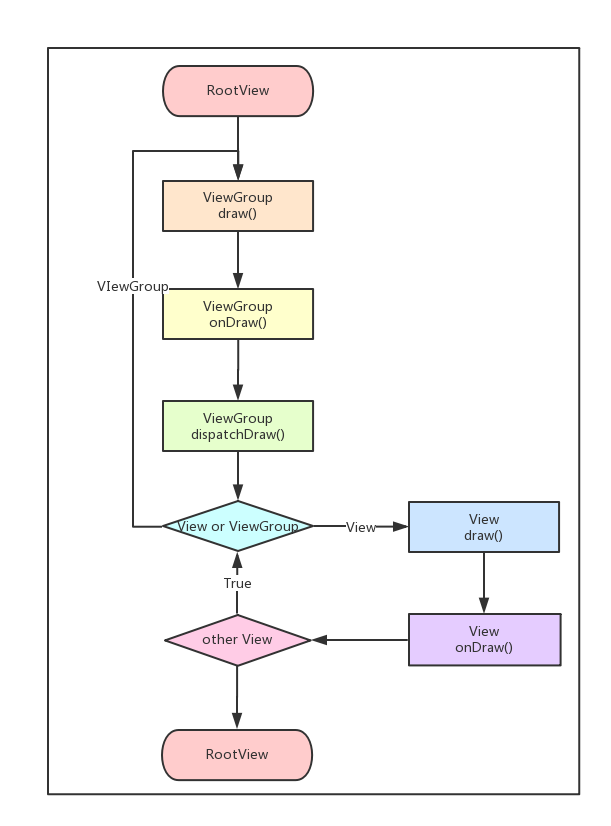

# Android View
>Android View框架相关  View的测量 布局 绘制过程
LinearLayout RelativeLayout实现源码分析


## 从setContentView与LayoutInflater说起
### setContentView分析
#### 相关关系

  

  Activity中有Window成员 实例化为PhoneWindow PhoneWindow是抽象Window类的实现类

  Window提供了绘制窗口的通用API PhoneWindow中包含了DecorView对象 是所有窗口(Activity界面)的根View

  具体的构如下

  

  通过hierarchyviewer工具分析一下


#### PhoneWindow的setContentView分析
>Window类的setContentView方法 而Window的setContentView方法是抽象的  所以查看PhoneWindow的setContentView()

1. setContentView方法
  ```java
    // This is the view in which the window contents are placed. It is either
    // mDecor itself, or a child of mDecor where the contents go.
    private ViewGroup mContentParent;

    @Override
    public void setContentView(int layoutResID) {
        // Note: FEATURE_CONTENT_TRANSITIONS may be set in the process of installing the window
        // decor, when theme attributes and the like are crystalized. Do not check the feature
        // before this happens.
        if (mContentParent == null) {
            //第一次调用
            //下面会详细分析
            installDecor();
        } else if (!hasFeature(FEATURE_CONTENT_TRANSITIONS)) {
            //移除该mContentParent下的所有View
            //又因为这个的存在  我们可以多次使用setContentView()
            mContentParent.removeAllViews();
        }
        //判断是否使用了Activity的过度动画
        if (hasFeature(FEATURE_CONTENT_TRANSITIONS)) {
          //设置动画场景
            final Scene newScene = Scene.getSceneForLayout(mContentParent, layoutResID,
                    getContext());
            transitionTo(newScene);
        } else {
            //将资源文件通过LayoutInflater对象装换为View树
            //在PhoneWindow的构造函数中 mLayoutInflater = LayoutInflater.from(context);
            mLayoutInflater.inflate(layoutResID, mContentParent);
        }

        //View中
        /**
         * Ask that a new dispatch of {@link #onApplyWindowInsets(WindowInsets)} be performed.
         */
        // public void requestApplyInsets() {
        //     requestFitSystemWindows();
        // }
        mContentParent.requestApplyInsets();
        final Callback cb = getCallback();
        if (cb != null && !isDestroyed()) {
            cb.onContentChanged();
        }
    }

    @Override
    public void setContentView(View view) {
        setContentView(view, new ViewGroup.LayoutParams(MATCH_PARENT, MATCH_PARENT));
    }

    @Override
    public void setContentView(View view, ViewGroup.LayoutParams params) {
        if (mContentParent == null) {
            installDecor();
        } else if (!hasFeature(FEATURE_CONTENT_TRANSITIONS)) {
            mContentParent.removeAllViews();
        }

        if (hasFeature(FEATURE_CONTENT_TRANSITIONS)) {
            view.setLayoutParams(params);
            final Scene newScene = new Scene(mContentParent, view);
            transitionTo(newScene);
        } else {
          //已经为View 直接使用View的addView方法追加到当前mContentParent中
            mContentParent.addView(view, params);
        }
        mContentParent.requestApplyInsets();
        final Callback cb = getCallback();
        //调用CallBack接口的onContentChange来通知Activity组件视图发生了变化
        if (cb != null && !isDestroyed()) {
            cb.onContentChanged();
        }
    }
  ```
2. installDecor方法
  ```java
    //截取部分主要分析代码
    private void installDecor() {
        if (mDecor == null) {
            //如果mDecor为空则创建一个DecorView实例
            // protected DecorView generateDecor() {
            //   return new DecorView(getContext(), -1);
            // }
            mDecor = generateDecor();
            mDecor.setDescendantFocusability(ViewGroup.FOCUS_AFTER_DESCENDANTS);
            mDecor.setIsRootNamespace(true);
            if (!mInvalidatePanelMenuPosted && mInvalidatePanelMenuFeatures != 0) {
                mDecor.postOnAnimation(mInvalidatePanelMenuRunnable);
            }
        }
        if (mContentParent == null) {
            //根据窗口的风格修饰 选择对应的修饰布局文件 将id为content的FrameLayout赋值于mContentParent
            mContentParent = generateLayout(mDecor);
            ...
          }
    }
  ```
  ```java
    protected ViewGroup generateLayout(DecorView decor) {
         // Apply data from current theme.
         //根据当前style修饰相应样式

         TypedArray a = getWindowStyle();

         ...
         //一堆if判断

         // 增加窗口修饰

         int layoutResource;
         int features = getLocalFeatures();

         ...
         //根据features选择不同的窗帘修饰布局文件得到
         //把选中的窗口修饰布局文件添加到DecorView中, 指定contentParent的值
         View in = mLayoutInflater.inflate(layoutResource, null);
         decor.addView(in, new ViewGroup.LayoutParams(MATCH_PARENT, MATCH_PARENT));
         mContentRoot = (ViewGroup) in;

         ViewGroup contentParent = (ViewGroup)findViewById(ID_ANDROID_CONTENT);
         if (contentParent == null) {
             throw new RuntimeException("Window couldn't find content container view");
         }

         ...
         return contentParent;
     }
  ```
  该方法的主要功能为 根据窗口的style为该窗口选择不同的窗口根布局文件 将mDecor作为根视图将窗口布局添加,获取id为content的FrameLayout返回给mContentParent对象  实质为阐释mDecor和mContentParent对象
3. (扩展)关于设置Activity属性需要在setContentView方法之前调用的问题

  在设置Activity属性的时候 比如requestWindowFeature(Window.FEATURE_NO_TITLE) 需要在setContentView方法之前调用
  ```java
    public boolean requestFeature(int featureId) {
        if (mContentParent != null) {
            throw new AndroidRuntimeException("requestFeature() must be called before adding content");
        }
        ...
    }
```

4. onContentChanged方法

  在PhoneWindow中没有重写getCallback相关方法 而在Window类下
  ```java
    /**
     * Return the current Callback interface for this window.
     */
    public final Callback getCallback() {
        return mCallback;
    }
  ```
  mCallback相关的赋值方法
  ```java
    /**
     * Set the Callback interface for this window, used to intercept key
     * events and other dynamic operations in the window.
     *
     * @param callback The desired Callback interface.
     */
    public void setCallback(Callback callback) {
        mCallback = callback;
    }
  ```
  setCallback方法在Activity中被使用
  ```java
    final void attach(Context context, ActivityThread aThread,
              Instrumentation instr, IBinder token, int ident,
              Application application, Intent intent, ActivityInfo info,
              CharSequence title, Activity parent, String id,
              NonConfigurationInstances lastNonConfigurationInstances,
              Configuration config, String referrer, IVoiceInteractor voiceInteractor) {
          ...
          mWindow.setCallback(this);
          ...
    }
  ```
  说明Activity实现了Window的CallBack接口 然后在Activity中找到onContentChanged方法
  ```java
    public void onContentChanged() {
    }
  ```
  对 空方法. 说明在Activity的布局改动时 (setContentView或者addContentView 方法执行完毕后会调用改方法)
   所以各种View的findViewById方法什么的可以放在这里

5. setContentView源码总结
  * 创建一个DecorView的对象mDector 该mDector将作为整个应用窗口的根视图
  *  根据根据Feature等style theme创建不同的窗口修饰布局文件 并且通过findViewById获取Activity布局文件该存放的地方
  *  将Activity的布局文件添加至id为content的FrameLayout内
  *  执行到当前页面还没有显示出来

6. Activity页面显示

  我们都知道Activity的实际开始于ActivityThread的main方法 当该方法调运完之后会调用该类的performLaunchActivity方法来创建要启动的Activity组件 这个过程中还会为该Activity组件创建窗口对象和视图对象 当组件创建完成后用过调用该类的handleResumeActivity方法将其激活

  ```java
    final void handleResumeActivity(IBinder token,
               boolean clearHide, boolean isForward, boolean reallyResume) {
                 ...
               if (!r.activity.mFinished && willBeVisible
                       && r.activity.mDecor != null && !r.hideForNow) {
                   ...
                   if (r.activity.mVisibleFromClient) {
                       r.activity.makeVisible();
                       //这里这里 通过调用Activity的makeVisible方法来显示我们通过setContentView创建的mDecor
                   }
                   ...
               }
           } else {
             ...
           }
       }
  ```
  ```java
    //Activity的makeVisible方法
    void makeVisible() {
         if (!mWindowAdded) {
             ViewManager wm = getWindowManager();
             wm.addView(mDecor, getWindow().getAttributes());
             mWindowAdded = true;
         }
         mDecor.setVisibility(View.VISIBLE);
     }
  ```
  至此通过setContentView方法设置的页面才最后显示出来

### LayoutInflater源码分析
1. 与setContentView相关

  在PhoneWindow的generateLayout中调用了
  ```java
    View in = mLayoutInflater.inflate(layoutResource, null);
  ```

2. LayoutInflater中获取实例化方法
  ```java
    /**
     * Obtains the LayoutInflater from the given context.
     */
    public static LayoutInflater from(Context context) {
        LayoutInflater LayoutInflater =
                (LayoutInflater) context.getSystemService(Context.LAYOUT_INFLATER_SERVICE);
        if (LayoutInflater == null) {
            throw new AssertionError("LayoutInflater not found.");
        }
        return LayoutInflater;
    }
  ```

3. inflate方法相关
  ```java
    public View inflate(@LayoutRes int resource, @Nullable ViewGroup root) {
        return inflate(resource, root, root != null);
    }

    public View inflate(XmlPullParser parser, @Nullable ViewGroup root) {
      return inflate(parser, root, root != null);
    }
  ```
  ```java
    public View inflate(@LayoutRes int resource, @Nullable ViewGroup root, boolean attachToRoot) {
        final Resources res = getContext().getResources();
        if (DEBUG) {
            Log.d(TAG, "INFLATING from resource: \"" + res.getResourceName(resource) + "\" ("
                    + Integer.toHexString(resource) + ")");
        }

        final XmlResourceParser parser = res.getLayout(resource);
        try {
            return inflate(parser, root, attachToRoot);
        } finally {
            parser.close();
        }
    }
  ```
  最后发现都需要调用

  ```java
  public View inflate(XmlPullParser parser, @Nullable ViewGroup root, boolean attachToRoot) {
          synchronized (mConstructorArgs) {
              Trace.traceBegin(Trace.TRACE_TAG_VIEW, "inflate");

              final Context inflaterContext = mContext;
              final AttributeSet attrs = Xml.asAttributeSet(parser);
              Context lastContext = (Context) mConstructorArgs[0];
              mConstructorArgs[0] = inflaterContext;
              //定义返回值 初始化传入形参 root
              View result = root;

              try {
                  // 找到根节点
                  int type;
                  while ((type = parser.next()) != XmlPullParser.START_TAG &&
                          type != XmlPullParser.END_DOCUMENT) {
                  }

                  //验证type是否为Start_Tag  保证xml文件正确
                  if (type != XmlPullParser.START_TAG) {
                      throw new InflateException(parser.getPositionDescription()
                              + ": No start tag found!");
                  }

                  //type为 root node
                  final String name = parser.getName();

                  if (DEBUG) {
                      System.out.println("**************************");
                      System.out.println("Creating root view: "
                              + name);
                      System.out.println("**************************");
                  }

                  if (TAG_MERGE.equals(name)) {
                      //处理 merge相关
                      //root需要非空 且attachToRoot为空
                      if (root == null || !attachToRoot) {
                          throw new InflateException("<merge /> can be used only with a valid "
                                  + "ViewGroup root and attachToRoot=true");
                      }
                      //递归inflate 方法调用
                      rInflate(parser, root, inflaterContext, attrs, false);
                  } else {
                      //根据tag节点创建view对象
                      final View temp = createViewFromTag(root, name, inflaterContext, attrs);

                      ViewGroup.LayoutParams params = null;

                      if (root != null) {
                          if (DEBUG) {
                              System.out.println("Creating params from root: " +
                                      root);
                          }
                          //根据root生成LayoutParams
                          params = root.generateLayoutParams(attrs);
                          if (!attachToRoot) {
                              //如果attachToRoot为flase 则调用setLayoutParams
                              temp.setLayoutParams(params);
                          }
                      }

                      if (DEBUG) {
                          System.out.println("-----> start inflating children");
                      }
                      //递归inflate剩下的children
                      rInflateChildren(parser, temp, attrs, true);

                      if (DEBUG) {
                          System.out.println("-----> done inflating children");
                      }

                      // We are supposed to attach all the views we found (int temp)
                      // to root. Do that now.
                      if (root != null && attachToRoot) {
                          //root非空且attachToRoot=true则将xml文件的root view加到形参提供的root里
                          root.addView(temp, params);
                      }

                      // Decide whether to return the root that was passed in or the
                      // top view found in xml.
                      if (root == null || !attachToRoot) {
                          //返回xml里解析的root view
                          result = temp;
                      }
                  }

              } catch (XmlPullParserException e) {
                  InflateException ex = new InflateException(e.getMessage());
                  ex.initCause(e);
                  throw ex;
              } catch (Exception e) {
                  InflateException ex = new InflateException(
                          parser.getPositionDescription()
                                  + ": " + e.getMessage());
                  ex.initCause(e);
                  throw ex;
              } finally {
                  // Don't retain static reference on context.
                  mConstructorArgs[0] = lastContext;
                  mConstructorArgs[1] = null;
              }

              Trace.traceEnd(Trace.TRACE_TAG_VIEW);
              //返回参数root或xml文件里的root view
              return result;
          }
      }

  ```
  相关inflate参数的结果
  

4. 相关方法解析
  在Inflate中多次被调用的rInflate

  ```java
     void rInflate(XmlPullParser parser, View parent, Context context,
             AttributeSet attrs, boolean finishInflate) throws XmlPullParserException, IOException {

         final int depth = parser.getDepth();
         int type;
         //XmlPullParser解析器的标准解析模式
         while (((type = parser.next()) != XmlPullParser.END_TAG ||
                 parser.getDepth() > depth) && type != XmlPullParser.END_DOCUMENT) {
             //找到start_tag节点
             if (type != XmlPullParser.START_TAG) {
                 continue;
             }
             //获取Name标记
             final String name = parser.getName();

             //private static final String TAG_REQUEST_FOCUS = "requestFocus";
             //处理requestFocus
             if (TAG_REQUEST_FOCUS.equals(name)) {
                 parseRequestFocus(parser, parent);
             // private static final String TAG_TAG = "tag";
             //处理tag
             } else if (TAG_TAG.equals(name)) {
                 parseViewTag(parser, parent, attrs);
             //private static final String TAG_INCLUDE = "include";
             //处理include
             } else if (TAG_INCLUDE.equals(name)) {
                 //如果是根节点则抛出异常
                 if (parser.getDepth() == 0) {
                     throw new InflateException("<include /> cannot be the root element");
                 }
                 parseInclude(parser, context, parent, attrs);
             //private static final String TAG_MERGE = "merge";
             //处理merge merge需要是xml中的根节点
             } else if (TAG_MERGE.equals(name)) {
                 throw new InflateException("<merge /> must be the root element");
             } else {
                 final View view = createViewFromTag(parent, name, context, attrs);
                 final ViewGroup viewGroup = (ViewGroup) parent;
                 final ViewGroup.LayoutParams params = viewGroup.generateLayoutParams(attrs);
                 rInflateChildren(parser, view, attrs, true);
                 viewGroup.addView(view, params);
             }
         }

          //parent的所有子节点都处理完毕的时候回onFinishInflate方法
         if (finishInflate) {
             parent.onFinishInflate();
         }
     }
     //可以添加自定义逻辑
      protected void onFinishInflate() {
      }
```


## View的测量 布局 绘制过程

### 测量之前的事情
View的整个绘制流程是开始于ViewRootImpl类的performTraversals方法(1k行)  根据相关设置来觉得十分要重新执行相关功能
```java
  private void performTraversals() {
    // cache mView since it is used so much below...
    final View host = mView;
    ...
    int childWidthMeasureSpec = getRootMeasureSpec(mWidth, lp.width);
    int childHeightMeasureSpec = getRootMeasureSpec(mHeight, lp.height);
    ...
    //measure
    mView.measure(childWidthMeasureSpec, childHeightMeasureSpec);
    ...
    //layout
    mView.layout(0, 0, mView.getMeasuredWidth(), mView.getMeasuredHeight());
    ...
    //draw
    mView.draw(canvas);
    ...
  }
  ```
  ```java
  private static int getRootMeasureSpec(int windowSize, int rootDimension) {
        int measureSpec;
        switch (rootDimension) {

        case ViewGroup.LayoutParams.MATCH_PARENT:
            // Window can't resize. Force root view to be windowSize.
            measureSpec = MeasureSpec.makeMeasureSpec(windowSize, MeasureSpec.EXACTLY);
            break;
        ...
        }
        return measureSpec;
    }
  ```
View measure整体流程图如下


### measure源码分析

结论:
* measure的过程就是父View向子View递归调用view.measure方法 (measure中回调onMeasure方法)的过程

* measure方法是 final的 只能重载onMeasure方法

* 最顶层的DocerView的MeasureSpec由ViewRootImpl的getRootMeasureSpec方法提供 LayoutParams的参数为MATCH_PARENT specMode是EXACTLY，specSize为物理屏幕大小

* 只要是ViewGroup的子类就必须要求LayoutParams继承子MarginLayoutParams 否则无法使用layout_margin参数

* View的getMeasuredWidth()和getMeasuredHeight()方法来获取View测量的宽高，要必须保证这两个方法在onMeasure流程之后被调用才能返回有效值。


```java
/**
 * <p>
 * This is called to find out how big a view should be. The parent supplies constraint information in the width and height parameters.
 * </p>
 *
 * <p>
 * The actual measurement work of a view is performed in
 * {@link #onMeasure(int, int)}, called by this method. Therefore, only
 * {@link #onMeasure(int, int)} can and must be overridden by subclasses.
 * </p>
 *
 *
 * @param widthMeasureSpec Horizontal space requirements as imposed by the
 *        parent
 * @param heightMeasureSpec Vertical space requirements as imposed by the
 *        parent
 *
 * @see #onMeasure(int, int)
 */
 //没舍得删这些注释  感觉重要的事情都说了   为了计算整个View树的实际大小 设置实际的高和宽 每个子View都是根据父视图和自身决定实际宽高的 在onMeasure()方法中进行实际测量.传入widthMeasureSpec和heightMeasureSpec参数来表示了父View的规格 不但传入了模式 还传入了size 而对于DecorView来说 传入的模式一般为EXACTLY模式 size对应屏幕的宽高. 所以说子View的大小是父子View共同决定的
public final void measure(int widthMeasureSpec, int heightMeasureSpec) {

               // measure ourselves, this should set the measured dimension flag back
               onMeasure(widthMeasureSpec, heightMeasureSpec);
   }
```

MeasureSpec内部类

MeasureSpec是View的内部类 int型，由高2位规格模式specMode和低30位具体尺寸specSize组成 其中specMode只有三种
* MeasureSpec.EXACTLY //确定模式，父View希望子View的大小是确定的，由specSize决定；
* MeasureSpec.AT_MOST //最多模式，父View希望子View的大小最多是specSize指定的值；
* MeasureSpec.UNSPECIFIED //未指定模式，父View完全依据子View的设计值来决定；

onMeasure()方法

```java
    /**
     * <p>
     * Measure the view and its content to determine the measured width and the
     * measured height. This method is invoked by {@link #measure(int, int)} and
     * should be overridden by subclasses to provide accurate and efficient
     * measurement of their contents.
     * </p>
     *
     * <p>
     * <strong>CONTRACT:</strong> When overriding this method, you
     * <em>must</em> call {@link #setMeasuredDimension(int, int)} to store the
     * measured width and height of this view. Failure to do so will trigger an
     * <code>IllegalStateException</code>, thrown by
     * {@link #measure(int, int)}. Calling the superclass'
     * {@link #onMeasure(int, int)} is a valid use.
     * </p>
     *
     * <p>
     * The base class implementation of measure defaults to the background size,
     * unless a larger size is allowed by the MeasureSpec. Subclasses should
     * override {@link #onMeasure(int, int)} to provide better measurements of
     * their content.
     * </p>
     *
     * <p>
     * If this method is overridden, it is the subclass's responsibility to make
     * sure the measured height and width are at least the view's minimum height
     * and width ({@link #getSuggestedMinimumHeight()} and
     * {@link #getSuggestedMinimumWidth()}).
     * </p>
     *
     * @param widthMeasureSpec horizontal space requirements as imposed by the parent.
     *                         The requirements are encoded with
     *                         {@link android.view.View.MeasureSpec}.
     * @param heightMeasureSpec vertical space requirements as imposed by the parent.
     *                         The requirements are encoded with
     *                         {@link android.view.View.MeasureSpec}.
     *
     * @see #getMeasuredWidth()
     * @see #getMeasuredHeight()
     * @see #setMeasuredDimension(int, int)
     * @see #getSuggestedMinimumHeight()
     * @see #getSuggestedMinimumWidth()
     * @see android.view.View.MeasureSpec#getMode(int)
     * @see android.view.View.MeasureSpec#getSize(int)
     */
    protected void onMeasure(int widthMeasureSpec, int heightMeasureSpec) {
        setMeasuredDimension(getDefaultSize(getSuggestedMinimumWidth(), widthMeasureSpec),
                getDefaultSize(getSuggestedMinimumHeight(), heightMeasureSpec));
    }
```
getDefaultSize方法相关
```java
  public static int getDefaultSize(int size, int measureSpec) {
    int result = size;
    //通过measureSpec得到mode和size
    int specMode = MeasureSpec.getMode(measureSpec);
    int specSize = MeasureSpec.getSize(measureSpec);

    switch (specMode) {
    case MeasureSpec.UNSPECIFIED:
        result = size;
        break;
    case MeasureSpec.AT_MOST:
    case MeasureSpec.EXACTLY:
        result = specSize;
        break;
    }
    return result;
  }

  //最小宽度和高度由View的Background尺寸和View的minXXX共同决定
  protected int getSuggestedMinimumHeight() {
      return (mBackground == null) ? mMinHeight : max(mMinHeight, mBackground.getMinimumHeight());

  }
  protected int getSuggestedMinimumWidth() {
      return (mBackground == null) ? mMinWidth : max(mMinWidth, mBackground.getMinimumWidth());
  }
```
setMeasuredDimension方法 对View的成员变量measuredWidth和measuredHeight变量赋值 也就是说该方法最终决定了View的大小
```java
  protected final void setMeasuredDimension(int measuredWidth, int measuredHeight) {
      boolean optical = isLayoutModeOptical(this);
      if (optical != isLayoutModeOptical(mParent)) {
          Insets insets = getOpticalInsets();
          int opticalWidth  = insets.left + insets.right;
          int opticalHeight = insets.top  + insets.bottom;

          measuredWidth  += optical ? opticalWidth  : -opticalWidth;
          measuredHeight += optical ? opticalHeight : -opticalHeight;
      }
      setMeasuredDimensionRaw(measuredWidth, measuredHeight);
  }

  public boolean isLayoutRequested() {
    return (mPrivateFlags & PFLAG_FORCE_LAYOUT) == PFLAG_FORCE_LAYOUT;
  }

  private void setMeasuredDimensionRaw(int measuredWidth, int measuredHeight) {
    mMeasuredWidth = measuredWidth;
    mMeasuredHeight = measuredHeight;

    mPrivateFlags |= PFLAG_MEASURED_DIMENSION_SET;
  }
```

至此一次最基础的View的measure过程就完成了  但是由于View可以嵌套  所以measure是递归传递的所以ViewGroup中需要对其子类进行measure过程 measureChildren方法实质为循环调用measureChild方法

而measureChild和measureChildWithMargins的区别是后者将margin和padding也作为了子视图的大小

一下分析measureChildWithMargins方法
```java
  protected void measureChildWithMargins(View child,
          int parentWidthMeasureSpec, int widthUsed,
          int parentHeightMeasureSpec, int heightUsed) {
      //获取当前子视图的LayoutParams
      final MarginLayoutParams lp = (MarginLayoutParams) child.getLayoutParams();
      //设定子View的测量规格
      final int childWidthMeasureSpec = getChildMeasureSpec(parentWidthMeasureSpec,
              mPaddingLeft + mPaddingRight + lp.leftMargin + lp.rightMargin
                      + widthUsed, lp.width);
      final int childHeightMeasureSpec = getChildMeasureSpec(parentHeightMeasureSpec,
              mPaddingTop + mPaddingBottom + lp.topMargin + lp.bottomMargin
                      + heightUsed, lp.height);
      //子view的继续调用
      child.measure(childWidthMeasureSpec, childHeightMeasureSpec);
  }

  //在getChildMeasureSpec中通过父View和本身的模式共同决定当前View的size
  public static int getChildMeasureSpec(int spec, int padding, int childDimension) {
        //获取当前父View的mode和size
        int specMode = MeasureSpec.getMode(spec);
        int specSize = MeasureSpec.getSize(spec);
        //获取父View的的剩余大小
        int size = Math.max(0, specSize - padding);
        //定义结果变量
        int resultSize = 0;
        int resultMode = 0;
        //根据对应的mode做处理
        //通过父View和本身的模式共同决定当前View的size
        switch (specMode) {
        // Parent has imposed an exact size on us
        case MeasureSpec.EXACTLY:
            if (childDimension >= 0) {
                resultSize = childDimension;
                resultMode = MeasureSpec.EXACTLY;
            } else if (childDimension == LayoutParams.MATCH_PARENT) {
                // Child wants to be our size. So be it.
                resultSize = size;
                resultMode = MeasureSpec.EXACTLY;
            } else if (childDimension == LayoutParams.WRAP_CONTENT) {
                // Child wants to determine its own size. It can't be
                // bigger than us.
                resultSize = size;
                resultMode = MeasureSpec.AT_MOST;
            }
            break;

        // Parent has imposed a maximum size on us
        case MeasureSpec.AT_MOST:
            if (childDimension >= 0) {
                // Child wants a specific size... so be it
                resultSize = childDimension;
                resultMode = MeasureSpec.EXACTLY;
            } else if (childDimension == LayoutParams.MATCH_PARENT) {
                // Child wants to be our size, but our size is not fixed.
                // Constrain child to not be bigger than us.
                resultSize = size;
                resultMode = MeasureSpec.AT_MOST;
            } else if (childDimension == LayoutParams.WRAP_CONTENT) {
                // Child wants to determine its own size. It can't be
                // bigger than us.
                resultSize = size;
                resultMode = MeasureSpec.AT_MOST;
            }
            break;

        // Parent asked to see how big we want to be
        case MeasureSpec.UNSPECIFIED:
            if (childDimension >= 0) {
                // Child wants a specific size... let him have it
                resultSize = childDimension;
                resultMode = MeasureSpec.EXACTLY;
            } else if (childDimension == LayoutParams.MATCH_PARENT) {
                // Child wants to be our size... find out how big it should
                // be
                resultSize = View.sUseZeroUnspecifiedMeasureSpec ? 0 : size;
                resultMode = MeasureSpec.UNSPECIFIED;
            } else if (childDimension == LayoutParams.WRAP_CONTENT) {
                // Child wants to determine its own size.... find out how
                // big it should be
                resultSize = View.sUseZeroUnspecifiedMeasureSpec ? 0 : size;
                resultMode = MeasureSpec.UNSPECIFIED;
            }
            break;
        }
        //将size和mode整合为MeasureSpec模式后返回
        return MeasureSpec.makeMeasureSpec(resultSize, resultMode);
    }

```

### layout源码分析
View layout整体流程与measure过程基本一样

结论:
* 需要根据ViewGroup本身的情况讨论 LinearLayout下会更看重子View的height和width 来安排对应位置 而RelativeLayout则更加关注子View的left right top bottom值 并且优先级高于width和height 甚至在部分自定义ViewGroup中 measure可能是无用的   直接使用layout方法来设置子View的位置也可以
* ViewGroup需要实现自己的layout逻辑
* layout_XXX中的各个熟悉都是针对子View的父ViewGroup的
* 同样使用View的getWidth()和getHeight()方法来获取View测量的宽高 必须保证这两个方法在onLayout流程之后被调用才能返回有效值

```java
  /**
     * Assign a size and position to a view and all of its
     * descendants
     *
     * <p>This is the second phase of the layout mechanism.
     * (The first is measuring). In this phase, each parent calls
     * layout on all of its children to position them.
     * This is typically done using the child measurements
     * that were stored in the measure pass().</p>
     *
     * <p>Derived classes should not override this method.
     * Derived classes with children should override
     * onLayout. In that method, they should
     * call layout on each of their children.</p>
     *
     * @param l Left position, relative to parent
     * @param t Top position, relative to parent
     * @param r Right position, relative to parent
     * @param b Bottom position, relative to parent
     */

     //同样注解写的很好了  分派给他和他的所有的子视图大小和位置
    @SuppressWarnings({"unchecked"})
    public void layout(int l, int t, int r, int b) {
        if ((mPrivateFlags3 & PFLAG3_MEASURE_NEEDED_BEFORE_LAYOUT) != 0) {
            onMeasure(mOldWidthMeasureSpec, mOldHeightMeasureSpec);
            mPrivateFlags3 &= ~PFLAG3_MEASURE_NEEDED_BEFORE_LAYOUT;
        }
         //调用setFrame方法把参数分别赋值于
        int oldL = mLeft;
        int oldT = mTop;
        int oldB = mBottom;
        int oldR = mRight;
        //判断view的位置是否发生过变化 , 确定是否对当前view重新layout
        boolean changed = isLayoutModeOptical(mParent) ?
                setOpticalFrame(l, t, r, b) : setFrame(l, t, r, b);


        if (changed || (mPrivateFlags & PFLAG_LAYOUT_REQUIRED) == PFLAG_LAYOUT_REQUIRED) {
            //调用onLayout
            onLayout(changed, l, t, r, b);
            mPrivateFlags &= ~PFLAG_LAYOUT_REQUIRED;
            ListenerInfo li = mListenerInfo;
            if (li != null && li.mOnLayoutChangeListeners != null) {
                ArrayList<OnLayoutChangeListener> listenersCopy =
                        (ArrayList<OnLayoutChangeListener>)li.mOnLayoutChangeListeners.clone();
                int numListeners = listenersCopy.size();
                for (int i = 0; i < numListeners; ++i) {
                    listenersCopy.get(i).onLayoutChange(this, l, t, r, b, oldL, oldT, oldR, oldB);
                }
            }
        }

        mPrivateFlags &= ~PFLAG_FORCE_LAYOUT;
        mPrivateFlags3 |= PFLAG3_IS_LAID_OUT;
    }
```

onLyayout方法
```java
  View中
  protected void onLayout(boolean changed, int left, int top, int right, int bottom) {
  }
  ViewGroup中
  protected abstract void onLayout(boolean changed,
        int l, int t, int r, int b);
```

均是空方法  后面会就LinearLayout和RelativeLayout源码进行分析

### draw源码分析

View的draw流程图如下



结论:
* View需要在子类中实现onDraw的过程
* 在ViewGroup中 会调用其子View的方法 顺序与子view的添加顺序一致


draw的源码也很长 但是官方也给出给出了draw的过程
```java
  public void draw(Canvas canvas) {
     ...
     /*
      * Draw traversal performs several drawing steps which must be executed
      * in the appropriate order:
      *
      *      1. Draw the background
      *      2. If necessary, save the canvas' layers to prepare for fading
      *      3. Draw view's content
      *      4. Draw children
      *      5. If necessary, draw the fading edges and restore layers
      *      6. Draw decorations (scrollbars for instance)
      */

     // Step 1, draw the background, if needed
     ...
     if (!dirtyOpaque) {
         drawBackground(canvas);
     }

     // skip step 2 & 5 if possible (common case)
     ...

     // Step 2, save the canvas' layers
     ...
         if (drawTop) {
             canvas.saveLayer(left, top, right, top + length, null, flags);
         }
     ...

     // Step 3, draw the content
     if (!dirtyOpaque) onDraw(canvas);

     // Step 4, draw the children
     dispatchDraw(canvas);

     // Step 5, draw the fade effect and restore layers
     ...
     if (drawTop) {
         matrix.setScale(1, fadeHeight * topFadeStrength);
         matrix.postTranslate(left, top);
         fade.setLocalMatrix(matrix);
         p.setShader(fade);
         canvas.drawRect(left, top, right, top + length, p);
     }
     ...

     // Step 6, draw decorations (scrollbars)
     onDrawScrollBars(canvas);
     ...
 }
```

#### Step 1, draw the background, if needed
```java
  // Step 1, draw the background, if needed
  //如果需要的话绘制背景

  if (!dirtyOpaque) {
      drawBackground(canvas);
  }
```

```java
  private void drawBackground(Canvas canvas) {

    	//通过xml中属性background或者代码中setBackGroundColor\setBackgroundResource等方法赋值的背景drawable
        final Drawable background = mBackground;
        if (background == null) {
            return;
        }

        //根据layout中确定的view位置来设置背景的绘制区域
        setBackgroundBounds();


        // 如果需要的话使用显示列表
        //canvas.isHardwareAccelerated() 硬件加速判定
        //硬件加速时会将图层缓存到GPU上 而不是重绘View的每一层
        if (canvas.isHardwareAccelerated() && mAttachInfo != null
                && mAttachInfo.mHardwareRenderer != null) {
            mBackgroundRenderNode = getDrawableRenderNode(background, mBackgroundRenderNode);

            final RenderNode renderNode = mBackgroundRenderNode;
            if (renderNode != null && renderNode.isValid()) {
                setBackgroundRenderNodeProperties(renderNode);
                ((DisplayListCanvas) canvas).drawRenderNode(renderNode);
                return;
            }
        }

        final int scrollX = mScrollX;
        final int scrollY = mScrollY;
        //调用Drawable的draw方法来完成背景的绘制工作
        if ((scrollX | scrollY) == 0) {
            background.draw(canvas);
        } else {
            canvas.translate(scrollX, scrollY);
            background.draw(canvas);
            canvas.translate(-scrollX, -scrollY);
        }
    }


    void setBackgroundBounds() {
    if (mBackgroundSizeChanged && mBackground != null) {
        mBackground.setBounds(0, 0,  mRight - mLeft, mBottom - mTop);
        mBackgroundSizeChanged = false;
        rebuildOutline();
    }
  }
```


#### Step 2, save the canvas' layers
```java
  // Step 2, save the canvas' layers
  //保存绘制图层

         if (drawTop) {
             canvas.saveLayer(left, top, right, top + length, null, flags);
         }

```

#### Step 3, draw the content
```java
  // Step 3, draw the content
  //对View的内容进行绘制
  if (!dirtyOpaque) onDraw(canvas);
```
```java
  /**
  * Implement this to do your drawing.
  *
  * @param canvas the canvas on which the background will be drawn
  */
  //onDraw也是空方法需要子类根据自身去实现相应的
  protected void onDraw(Canvas canvas) {
  }

```

#### Step 4, draw the children
```java
  // Step 4, draw the children
  //绘制其子View
  dispatchDraw(canvas);
```

```java
  /**
   * Called by draw to draw the child views. This may be overridden
   * by derived classes to gain control just before its children are drawn
   * (but after its own view has been drawn).
   * @param canvas the canvas on which to draw the view
   */
  protected void dispatchDraw(Canvas canvas) {
  //dispatchDraw同样空方法 与onDraw不同的是dispatchDraw在ViewGroup中被重写
  }
```

ViewGroup
```java
  //dispatchDraw方法中根据子View的不同情况 包括但不只包括该View是否显示 是否有进入或消失动画等进行了部分的调整
  protected void dispatchDraw(Canvas canvas) {
      ...
        more |= drawChild(canvas, transientChild, drawingTime);
      ...
  }

  protected boolean drawChild(Canvas canvas, View child, long drawingTime) {
    return child.draw(canvas, this, drawingTime);
  }
```
#### Step 5, draw the fade effect and restore layers

```java
  // Step 5, draw the fade effect and restore layers
  //绘制过度效果和恢复图层
  if (drawTop) {
      matrix.setScale(1, fadeHeight * topFadeStrength);
      matrix.postTranslate(left, top);
      fade.setLocalMatrix(matrix);
      p.setShader(fade);
      canvas.drawRect(left, top, right, top + length, p);
  }
```

####  Step 6, draw decorations (scrollbars)
```java
  // Step 6, draw decorations (scrollbars)
  //对滚动条进行绘制
  onDrawScrollBars(canvas);
```


## LinearLayout 源码分析

### measure过程
#### 主要过程
* 根据布局方向选择measure过程分支
* 初始化相关变量
* 对View进行第一次测量
* mTotalLength的再次测量
* 二次测量部分View和对为测量的子View进行测量


```java
  protected void onMeasure(int widthMeasureSpec, int heightMeasureSpec) {
      //判断布局方向
      if (mOrientation == VERTICAL) {
          measureVertical(widthMeasureSpec, heightMeasureSpec);
      } else {
          measureHorizontal(widthMeasureSpec, heightMeasureSpec);
      }
  }
```
measureVertical和measureHorizontal只是布局方向上的区别 以下主要分析measureVertical方法

#### 初始化相关变量
```java
  //mTotalLength是记录内部使用的高度也就是子View的高度和 而不是LinearLayout的高度
  mTotalLength = 0;
  //子视图的最大宽度(不包括layout_weight>0的子View)
  int maxWidth = 0;
  int childState = 0;
  int alternativeMaxWidth = 0;
  //子视图的最大宽度(仅包含layout_weight>0的子View)
  int weightedMaxWidth = 0;
  //子视图是否均为fillParent 用于判断是否需要重新计算
  boolean allFillParent = true;
  //权重值的总和
  float totalWeight = 0;
  //子View的数量(统一级别下)
  final int count = getVirtualChildCount();
  //高度宽度模式
  final int widthMode = MeasureSpec.getMode(widthMeasureSpec);
  final int heightMode = MeasureSpec.getMode(heightMeasureSpec);
  //子View的宽度是否需要由父View决定
  boolean matchWidth = false;
  boolean skippedMeasure = false;
  //第几个子View的baseLine作为LinearLayout的基准线
  final int baselineChildIndex = mBaselineAlignedChildIndex;  
  //mUseLargestChild为是否使用最大子元素的尺寸作为标准再次测量
  final boolean useLargestChild = mUseLargestChild;
  //子View中最高高度
  int largestChildHeight = Integer.MIN_VALUE;
```

#### 第一次测量
```java
  // See how tall everyone is. Also remember max width.
  for (int i = 0; i < count; ++i) {
      final View child = getVirtualChildAt(i);

      // 测量为null的子视图的高度
      // measureNullChild() 暂时返回 0 便于扩展
      if (child == null) {
          mTotalLength += measureNullChild(i);
          continue;
      }
      //Visibility为Gone的时候跳过该View
      // getChildrenSkipCount()方法同样返回0 便于扩展
      if (child.getVisibility() == View.GONE) {
         i += getChildrenSkipCount(child, i);
         continue;
      }
      //根据showDivider的值(通过hasDividerBeforeChildAt()) 来决定当前子View是否需要添加分割线的高度
      if (hasDividerBeforeChildAt(i)) {
          mTotalLength += mDividerHeight;
      }

      //会将子view的LayoutParams强转为父View的LayoutParams类型
      LinearLayout.LayoutParams lp = (LinearLayout.LayoutParams)child.getLayoutParams();

      totalWeight += lp.weight;

      if (heightMode == MeasureSpec.EXACTLY && lp.height == 0 && lp.weight > 0) {
          // 满足该条件的话 不需要现在计算该子视图的高度 测量工作会在之后进行
          // 若子View的height=0 且weight> 0 则说明该View希望使用的是LinearLayout的剩余空间
          // LinearLayout是EXACTLY模式的说明LinearLayout高度已经确定 不需要依赖子View的测量结果来计算自己 就无需测量该子View

          final int totalLength = mTotalLength;
          mTotalLength = Math.max(totalLength, totalLength + lp.topMargin + lp.bottomMargin);
          skippedMeasure = true;
      } else {
          //测量子View

          int oldHeight = Integer.MIN_VALUE;

          //当前View的height=0 且weight> 0 则说明该LinearLayout的高度需要靠子View测量(不需要的在上面分支处理了)
          //将子View的高度设为-1 防止子View高度为0
          if (lp.height == 0 && lp.weight > 0) {
              oldHeight = 0;
              lp.height = LayoutParams.WRAP_CONTENT;
          }

          //调用子View的measureChildWithMargins() 对子View进行测量
          //第四个参数表示当前已使用的宽度  因为是竖直模式 所以为0
          //最后一个参数表示已使用的高度 如果之前的子View或者当前的View有weight属性 则当前子视图使用 LinearLayout 的所有高度 已使用的高度为0
          measureChildBeforeLayout(child, i, widthMeasureSpec, 0, heightMeasureSpec,
                 totalWeight == 0 ? mTotalLength : 0);

          if (oldHeight != Integer.MIN_VALUE) {
             //测量完成后 重置子View高度
             lp.height = oldHeight;
          }

          final int childHeight = child.getMeasuredHeight();
          final int totalLength = mTotalLength;
          // 比较child测量前后总高度 取较大值
          ///getNextLocationOffset() 返回0 便于扩展
          mTotalLength = Math.max(totalLength, totalLength + childHeight + lp.topMargin + lp.bottomMargin + getNextLocationOffset(child));
          // 设置最高子视图大小
          if (useLargestChild) {
              largestChildHeight = Math.max(childHeight, largestChildHeight);
          }
      }

       // mBaselineChildTop 表示指定的 baseline 的子视图的顶部高度
      if ((baselineChildIndex >= 0) && (baselineChildIndex == i + 1)) {
         mBaselineChildTop = mTotalLength;
      }

      // 设置为 baseline 的子视图的前面不允许设置 weiget 属性
      if (i < baselineChildIndex && lp.weight > 0) {
          throw new RuntimeException("A child of LinearLayout with index "
                  + "less than mBaselineAlignedChildIndex has weight > 0, which "
                  + "won't work.  Either remove the weight, or don't set "
                  + "mBaselineAlignedChildIndex.");
      }

      // 宽度测量相关

      boolean matchWidthLocally = false;

      //当LinearLayout非EXACTLY模式 并且自View为MATCH_PARENT时
      //设置matchWidth和matchWidthLocally为true
      //该子View占据LinearLayout水平方向上所有空间

      if (widthMode != MeasureSpec.EXACTLY && lp.width == LayoutParams.MATCH_PARENT) {
          matchWidth = true;
          matchWidthLocally = true;
      }

      final int margin = lp.leftMargin + lp.rightMargin;
      final int measuredWidth = child.getMeasuredWidth() + margin;

      //对一堆变量赋值
      maxWidth = Math.max(maxWidth, measuredWidth);
      childState = combineMeasuredStates(childState, child.getMeasuredState());

      allFillParent = allFillParent && lp.width == LayoutParams.MATCH_PARENT;
      if (lp.weight > 0) {
          weightedMaxWidth = Math.max(weightedMaxWidth,
                  matchWidthLocally ? margin : measuredWidth);
      } else {
          alternativeMaxWidth = Math.max(alternativeMaxWidth,
                  matchWidthLocally ? margin : measuredWidth);
      }

      i += getChildrenSkipCount(child, i);
  }
```

#### 二次测量mTotalLength

```java
  //根据hasDividerBeforeChildAt得到showDivider的值是否为end 来判断是否需要加上divider的高度
  if (mTotalLength > 0 && hasDividerBeforeChildAt(count))
      mTotalLength += mDividerHeight;
  }
  //如果高度测量模式为AT_MOST或者UNSPECIFIED 则进行二次测量 且设置了measureWithLargestChild
  if (useLargestChild && (heightMode == MeasureSpec.AT_MOST ||
      heightMode == MeasureSpec.UNSPECIFIED)) {
      mTotalLength = 0;
      for (int i = 0; i < count; ++i) {
          final View child = getVirtualChildAt(i);
          if (child == null) {
              mTotalLength += measureNullChild(i);
              continue;
          }
          if (child.getVisibility() == GONE) {
              i += getChildrenSkipCount(child, i);
              continue;
          }
          final LinearLayout.LayoutParams lp = (LinearLayout.LayoutParams)
                  child.getLayoutParams();
          // 计算所有子View的高度之和
          final int totalLength = mTotalLength;
          mTotalLength = Math.max(totalLength, totalLength + largestChildHeight +
                  lp.topMargin + lp.bottomMargin + getNextLocationOffset(child));
      }
  }
```
就是需要useLargestChild

而 mUseLargestChild = a.getBoolean(R.styleable.LinearLayout_measureWithLargestChild, false);

就是说仅在LinearLayout的measureWithLargestChild属性设置为True时(默认为false)才可能出现某个child被二次测量

实例如下


#### 二次测量部分View和对为测量的子View进行测量

```java

   //加上padding的值
   mTotalLength += mPaddingTop + mPaddingBottom;
   int heightSize = mTotalLength;
   //minHeight和当前使用的高度比较取较大值
   heightSize = Math.max(heightSize, getSuggestedMinimumHeight());

   //根据heightMeasureSpec协助计算heightSizeAndState的大小
   //resolveSizeAndState方法之后会分析
   int heightSizeAndState = resolveSizeAndState(heightSize, heightMeasureSpec, 0);
   heightSize = heightSizeAndState & MEASURED_SIZE_MASK;

   // Either expand children with weight to take up available space or
   // shrink them if they extend beyond our current bounds. If we skipped
   // measurement on any children, we need to measure them now.


   //delta为额外的空间 及LinearLayout中未被分配的空间(可以为负)
   int delta = heightSize - mTotalLength;
   if (skippedMeasure || delta != 0 && totalWeight > 0.0f) {
       //skippedMeasure为第一次测量下对跳过测量的子View设置的
       //weightSum为权重和 如果设置了总权重则使用我们所设置的  如果没有则使用子View的weight和
       float weightSum = mWeightSum > 0.0f ? mWeightSum : totalWeight;

       mTotalLength = 0;
       //测量什么的
       for (int i = 0; i < count; ++i) {
           final View child = getVirtualChildAt(i);

           if (child.getVisibility() == View.GONE) {
               continue;
           }

           LinearLayout.LayoutParams lp = (LinearLayout.LayoutParams) child.getLayoutParams();

           float childExtra = lp.weight;
           if (childExtra > 0) {
               // Child said it could absorb extra space -- give him his share
               //计算weight属性分配的大小
               int share = (int) (childExtra * delta / weightSum);
               //权重和减去已经分配权重
               weightSum -= childExtra;
               //剩余高度减去分配的高度
               delta -= share;

               final int childWidthMeasureSpec = getChildMeasureSpec(widthMeasureSpec,
                       mPaddingLeft + mPaddingRight +
                               lp.leftMargin + lp.rightMargin, lp.width);

               // TODO: Use a field like lp.isMeasured to figure out if this
               // child has been previously measured


               if ((lp.height != 0) || (heightMode != MeasureSpec.EXACTLY)) {
                   //子视图已经被测量过
                   //非EXACTLY view需要加上share
                   int childHeight = child.getMeasuredHeight() + share;
                   if (childHeight < 0) {
                       childHeight = 0;
                   }
                   //重新测量View
                   child.measure(childWidthMeasureSpec,
                           MeasureSpec.makeMeasureSpec(childHeight, MeasureSpec.EXACTLY));
               } else {
                   //如果当前是EXACTLY模式 说明没有被测量 需要进行测量
                   //子视图首次被测量
                   //EXACTLY模式下 将weight占比的高度分配给子View    
                   child.measure(childWidthMeasureSpec,
                           MeasureSpec.makeMeasureSpec(share > 0 ? share : 0,
                                   MeasureSpec.EXACTLY));
               }

               // Child may now not fit in vertical dimension.
               childState = combineMeasuredStates(childState, child.getMeasuredState()
                       & (MEASURED_STATE_MASK>>MEASURED_HEIGHT_STATE_SHIFT));
           }

          //处理子视图宽度
           final int margin =  lp.leftMargin + lp.rightMargin;
           final int measuredWidth = child.getMeasuredWidth() + margin;
           maxWidth = Math.max(maxWidth, measuredWidth);

           boolean matchWidthLocally = widthMode != MeasureSpec.EXACTLY &&
                   lp.width == LayoutParams.MATCH_PARENT;

           alternativeMaxWidth = Math.max(alternativeMaxWidth,
                   matchWidthLocally ? margin : measuredWidth);

           allFillParent = allFillParent && lp.width == LayoutParams.MATCH_PARENT;

           final int totalLength = mTotalLength;
           mTotalLength = Math.max(totalLength, totalLength + child.getMeasuredHeight() +
                   lp.topMargin + lp.bottomMargin + getNextLocationOffset(child));
       }

       // Add in our padding
       mTotalLength += mPaddingTop + mPaddingBottom;
       // TODO: Should we recompute the heightSpec based on the new total length?
   } else {
       alternativeMaxWidth = Math.max(alternativeMaxWidth,
                                      weightedMaxWidth);


       // We have no limit, so make all weighted views as tall as the largest child.
       // Children will have already been measured once.
       if (useLargestChild && heightMode != MeasureSpec.EXACTLY) {
           for (int i = 0; i < count; i++) {
               final View child = getVirtualChildAt(i);

               if (child == null || child.getVisibility() == View.GONE) {
                   continue;
               }

               final LinearLayout.LayoutParams lp =
                       (LinearLayout.LayoutParams) child.getLayoutParams();

               float childExtra = lp.weight;
               if (childExtra > 0) {
                  //使用最大子视图高度测量
                   child.measure(
                           MeasureSpec.makeMeasureSpec(child.getMeasuredWidth(),
                                   MeasureSpec.EXACTLY),
                           MeasureSpec.makeMeasureSpec(largestChildHeight,
                                   MeasureSpec.EXACTLY));
               }
           }
       }
   }

   if (!allFillParent && widthMode != MeasureSpec.EXACTLY) {
       maxWidth = alternativeMaxWidth;
   }

   maxWidth += mPaddingLeft + mPaddingRight;

   // Check against our minimum width
   maxWidth = Math.max(maxWidth, getSuggestedMinimumWidth());

   setMeasuredDimension(resolveSizeAndState(maxWidth, widthMeasureSpec, childState),
           heightSizeAndState);

   if (matchWidth) {
       forceUniformWidth(count, heightMeasureSpec);
   }
```
resolveSizeAndState方法 定义在View中
```java
/**
   * Utility to reconcile a desired size and state, with constraints imposed
   * by a MeasureSpec. Will take the desired size, unless a different size
   * is imposed by the constraints. The returned value is a compound integer,
   * with the resolved size in the {@link #MEASURED_SIZE_MASK} bits and
   * optionally the bit {@link #MEASURED_STATE_TOO_SMALL} set if the
   * resulting size is smaller than the size the view wants to be.
   *
   * @param size How big the view wants to be.
   * @param measureSpec Constraints imposed by the parent.
   * @param childMeasuredState Size information bit mask for the view's
   *                           children.
   * @return Size information bit mask as defined by
   *         {@link #MEASURED_SIZE_MASK} and
   *         {@link #MEASURED_STATE_TOO_SMALL}.
   */
  public static int resolveSizeAndState(int size, int measureSpec, int childMeasuredState) {
      final int specMode = MeasureSpec.getMode(measureSpec);
      final int specSize = MeasureSpec.getSize(measureSpec);
      final int result;
      switch (specMode) {
          case MeasureSpec.AT_MOST:
              if (specSize < size) {
                  result = specSize | MEASURED_STATE_TOO_SMALL;
              } else {
                  result = size;
              }
              break;
          case MeasureSpec.EXACTLY:
              result = specSize;
              break;
          case MeasureSpec.UNSPECIFIED:
          default:
              result = size;
      }
      return result | (childMeasuredState & MEASURED_STATE_MASK);
  }
```

###### delta为负的相关解析
相关代码及效果如下


根据之前的measure流程分析一下

* 相关变量初始化
* 第一次测量  两个子TextView都会被测量 TextView1.height = TextView1.height = 500dp 则mToatalLength为1000dp
* mToatalLength再次测量跳过
* 计算delta delta = heightSize - mTotalLength 根据resolveSizeAndState方法 父LinearLayout是EXACTLY模式 所以最终heightSize为500dp delta = -500dp
* 根据weight分配剩余空间 TextView1.height = 500 + 1 / 5 * (- 500) = 400 dp
  TextView2.height = 500 + 4 / 5 * (- 500) = 100 dp


### layout过程


```java
  protected void onLayout(boolean changed, int l, int t, int r, int b) {
    if (mOrientation == VERTICAL) {
        layoutVertical(l, t, r, b);
    } else {
        layoutHorizontal(l, t, r, b);
    }
  }
```
我们可以看出 同样是分成水平和竖直两个方向的 同样分析竖直 方向下的layout过程

```java
/**
    * Position the children during a layout pass if the orientation of this
    * LinearLayout is set to {@link #VERTICAL}.
    *
    * @see #getOrientation()
    * @see #setOrientation(int)
    * @see #onLayout(boolean, int, int, int, int)
    * @param left
    * @param top
    * @param right
    * @param bottom
    */
   void layoutVertical(int left, int top, int right, int bottom) {
       final int paddingLeft = mPaddingLeft;

       int childTop;
       int childLeft;

       //父View默认子View的宽度
       final int width = right - left;
       //子View的右侧默认位置
       int childRight = width - mPaddingRight;

       // 子View的可用空间大小
       int childSpace = width - paddingLeft - mPaddingRight;

       //子View的个数
       final int count = getVirtualChildCount();

       final int majorGravity = mGravity & Gravity.VERTICAL_GRAVITY_MASK;
       final int minorGravity = mGravity & Gravity.RELATIVE_HORIZONTAL_GRAVITY_MASK;

       //根据LinearLayout设置的对其方式 设置第一个子View的Top值
       switch (majorGravity) {
          case Gravity.BOTTOM:
              // mTotalLength contains the padding already
              childTop = mPaddingTop + bottom - top - mTotalLength;
              break;

              // mTotalLength contains the padding already
          case Gravity.CENTER_VERTICAL:
              childTop = mPaddingTop + (bottom - top - mTotalLength) / 2;
              break;

          case Gravity.TOP:
          default:
              childTop = mPaddingTop;
              break;
       }

       //遍历各个子View
       for (int i = 0; i < count; i++) {
           final View child = getVirtualChildAt(i);
           if (child == null) {
               childTop += measureNullChild(i);
           } else if (child.getVisibility() != GONE) {
                //LinearLayout中子View的宽和高有measure过程决定
               final int childWidth = child.getMeasuredWidth();
               final int childHeight = child.getMeasuredHeight();
               //获取子View的LayoutParams
               final LinearLayout.LayoutParams lp =
                       (LinearLayout.LayoutParams) child.getLayoutParams();

               int gravity = lp.gravity;
               if (gravity < 0) {
                   gravity = minorGravity;
               }
               final int layoutDirection = getLayoutDirection();
               final int absoluteGravity = Gravity.getAbsoluteGravity(gravity, layoutDirection);
               //根据子View的对其方式设置Left值
               switch (absoluteGravity & Gravity.HORIZONTAL_GRAVITY_MASK) {
                   case Gravity.CENTER_HORIZONTAL:
                       childLeft = paddingLeft + ((childSpace - childWidth) / 2)
                               + lp.leftMargin - lp.rightMargin;
                       break;

                   case Gravity.RIGHT:
                       childLeft = childRight - childWidth - lp.rightMargin;
                       break;

                   case Gravity.LEFT:
                   default:
                       childLeft = paddingLeft + lp.leftMargin;
                       break;
               }
               //如果有分割线 添加分割线的高度
               if (hasDividerBeforeChildAt(i)) {
                   childTop += mDividerHeight;
               }
               //子View的top修改
               childTop += lp.topMargin;
               //用setChildFrame()方法设置子控件控件的在父控件上的坐标轴
               setChildFrame(child, childLeft, childTop + getLocationOffset(child),
                       childWidth, childHeight);
               childTop += childHeight + lp.bottomMargin + getNextLocationOffset(child);

               i += getChildrenSkipCount(child, i);
           }
       }
   }
```

#### draw 源码分析
```java
  protected void onDraw(Canvas canvas) {
    if (mDivider == null) {
        return;
    }

    if (mOrientation == VERTICAL) {
        drawDividersVertical(canvas);
    } else {
        drawDividersHorizontal(canvas);
    }
  }
```
同样主要分析垂直方向的处理

```java

  void drawDividersVertical(Canvas canvas) {
      final int count = getVirtualChildCount();
      //根据计算好的坐标绘制对应的子View
      for (int i = 0; i < count; i++) {
          final View child = getVirtualChildAt(i);

          if (child != null && child.getVisibility() != GONE) {
              if (hasDividerBeforeChildAt(i)) {
                  final LayoutParams lp = (LayoutParams) child.getLayoutParams();
                  final int top = child.getTop() - lp.topMargin - mDividerHeight;
                  drawHorizontalDivider(canvas, top);
              }
          }
      }
      //绘制分割线
      if (hasDividerBeforeChildAt(count)) {
          final View child = getLastNonGoneChild();
          int bottom = 0;
          if (child == null) {
              bottom = getHeight() - getPaddingBottom() - mDividerHeight;
          } else {
              final LayoutParams lp = (LayoutParams) child.getLayoutParams();
              bottom = child.getBottom() + lp.bottomMargin;
          }
          drawHorizontalDivider(canvas, bottom);
      }
  }

  void drawHorizontalDivider(Canvas canvas, int top) {
    mDivider.setBounds(getPaddingLeft() + mDividerPadding, top,
            getWidth() - getPaddingRight() - mDividerPadding, top + mDividerHeight);
    mDivider.draw(canvas);
  }
```

## RelativeLayout  源码分析
> 继承自ViewGroup 没有重载onDraw方法 内部子View又是相对 只要计算出View的坐标 layout过程同样简单

### measure过程
#### 主要过程
1. 将内部View根据纵向关系和横向关系排序
2. 初始化相关变量
3. 遍历水平关系的View
4. 遍历竖直关系的View
5. baseline计算
6. 宽度和高度修正

#### 1 将内部View根据纵向关系和横向关系排序
>layout_toRightOf 为横向关系  layout_below为纵向关系

```java
    //首先会根据mDirtyHierarchy的值判断是否需要将子View重新排序
    if (mDirtyHierarchy) {
        mDirtyHierarchy = false;
        sortChildren();
    }
```
相关调用方法
```java
    //mDirtyHierarchy的值只有在requestLayout方法下被更新
    public void requestLayout() {
        super.requestLayout();
        mDirtyHierarchy = true;
    }

    //sortChildren()方法对横向纵向关系的view的数组进行非空判断 用DependencyGraph进行判断
    private void sortChildren() {
        final int count = getChildCount();
        if (mSortedVerticalChildren == null || mSortedVerticalChildren.length != count) {
            mSortedVerticalChildren = new View[count];
        }

        if (mSortedHorizontalChildren == null || mSortedHorizontalChildren.length != count) {
            mSortedHorizontalChildren = new View[count];
        }

        final DependencyGraph graph = mGraph;
        graph.clear();

        for (int i = 0; i < count; i++) {
            graph.add(getChildAt(i));
        }

        graph.getSortedViews(mSortedVerticalChildren, RULES_VERTICAL);
        graph.getSortedViews(mSortedHorizontalChildren, RULES_HORIZONTAL);
    }
```
**DependencyGraph的相关方法**
```java
    private static class DependencyGraph {
        ...
        /**
         * Adds a view to the graph.
         *
         * @param view The view to be added as a node to the graph.
         */
        void add(View view) {
            //因为是图 根据view生成一个节点
            final int id = view.getId();
            final Node node = Node.acquire(view);
            //如果是有效的id 则将该节点添加到List中
            if (id != View.NO_ID) {
                mKeyNodes.put(id, node);
            }

            mNodes.add(node);
        }     

          /**
           * Builds a sorted list of views. The sorting order depends on the dependencies
           * between the view. For instance, if view C needs view A to be processed first
           * and view A needs view B to be processed first, the dependency graph
           * is: B -> A -> C. The sorted array will contain views B, A and C in this order.
           *
           * @param sorted The sorted list of views. The length of this array must
           *        be equal to getChildCount().
           * @param rules The list of rules to take into account.
           */
          void getSortedViews(View[] sorted, int... rules) {
            //当前View找不到其它的可依赖的View时  作为root节点
              final ArrayDeque<Node> roots = findRoots(rules);
              int index = 0;

              Node node;
              //读取root的下一个node
              while ((node = roots.pollLast()) != null) {
                  final View view = node.view;
                  final int key = view.getId();

              //将符合规则的View加到 sorted中

                  sorted[index++] = view;

                  final ArrayMap<Node, DependencyGraph> dependents = node.dependents;
                  //dependents 依赖该node的node  (A C依赖B 则B的dependents中存A C)
                  final int count = dependents.size();
                  //遍历所有依赖自己的node
                  for (int i = 0; i < count; i++) {
                      final Node dependent = dependents.keyAt(i);
                      //dependencies 是被依赖的的node的规则和node(A 依赖 B D 则dependencies存有B D )
                      final SparseArray<Node> dependencies = dependent.dependencies;

                      //移除当前node和dependencies的依赖关系
                      dependencies.remove(key);
                      //如果解除依赖后没有其它依赖 则将该node也视为rootNode
                      if (dependencies.size() == 0) {
                          roots.add(dependent);
                      }
                  }
              }

              if (index < sorted.length) {
                  throw new IllegalStateException("Circular dependencies cannot exist in RelativeLayout");
              }
          }
  ...
}
```
eg: A依赖B B依赖C 首先存入C 因为不依赖任何其它的

```java

        /**
         * Finds the roots of the graph. A root is a node with no dependency and
         * with [0..n] dependents.
         *
         * @param rulesFilter The list of rules to consider when building the
         *        dependencies
         *
         * @return A list of node, each being a root of the graph
         */
        private ArrayDeque<Node> findRoots(int[] rulesFilter) {
          //keyNodes为nodelist
            final SparseArray<Node> keyNodes = mKeyNodes;
            final ArrayList<Node> nodes = mNodes;
            final int count = nodes.size();

          //初始化依赖该node的node和该node依赖的node相关参数
            for (int i = 0; i < count; i++) {
                final Node node = nodes.get(i);
                node.dependents.clear();
                node.dependencies.clear();
            }


            //遍历所有node  存入当前view和他所依赖的关系
            for (int i = 0; i < count; i++) {
                final Node node = nodes.get(i);

                final LayoutParams layoutParams = (LayoutParams) node.view.getLayoutParams();
                //取出当前View所有的依赖关系
                final int[] rules = layoutParams.mRules;
                final int rulesCount = rulesFilter.length;

                //遍历当前View所有的
                for (int j = 0; j < rulesCount; j++) {
                  //rule对应被依赖view的id
                    final int rule = rules[rulesFilter[j]];
                    if (rule > 0) {
                        //找到被依赖的node
                        final Node dependency = keyNodes.get(rule);
                        //跳过空view和本身
                        if (dependency == null || dependency == node) {
                            continue;
                        }
                        //添加依赖被依赖的node
                        dependency.dependents.put(node, this);
                        node.dependencies.put(rule, dependency);
                    }
                }
            }

            final ArrayDeque<Node> roots = mRoots;
            roots.clear();

            // 再次遍历  如果该node的依赖关系为0 即该view不依赖任何view 则视为rootView
            for (int i = 0; i < count; i++) {
                final Node node = nodes.get(i);
                if (node.dependencies.size() == 0) roots.addLast(node);
            }

            return roots;
        }
```

#### 2 初始化相关变量
```java
  int myWidth = -1;
  int myHeight = -1;

  int width = 0;
  int height = 0;

  final int widthMode = MeasureSpec.getMode(widthMeasureSpec);
  final int heightMode = MeasureSpec.getMode(heightMeasureSpec);
  final int widthSize = MeasureSpec.getSize(widthMeasureSpec);
  final int heightSize = MeasureSpec.getSize(heightMeasureSpec);

  // 如果不是UNSPECIFIED模式 则将widthSize赋值于myWidth
  if (widthMode != MeasureSpec.UNSPECIFIED) {
      myWidth = widthSize;
  }
  // 如果不是UNSPECIFIED模式 则将heightSize赋值于myHeight
  if (heightMode != MeasureSpec.UNSPECIFIED) {
      myHeight = heightSize;
  }
  //如果是EXACTLY模式 则将myWidth和myHeight记录
  if (widthMode == MeasureSpec.EXACTLY) {
      width = myWidth;
  }

  if (heightMode == MeasureSpec.EXACTLY) {
      height = myHeight;
  }

  View ignore = null;
  //判断是否为Start 和  top 确定左上角坐标
  int gravity = mGravity & Gravity.RELATIVE_HORIZONTAL_GRAVITY_MASK;
  final boolean horizontalGravity = gravity != Gravity.START && gravity != 0;
  gravity = mGravity & Gravity.VERTICAL_GRAVITY_MASK;
  final boolean verticalGravity = gravity != Gravity.TOP && gravity != 0;

  int left = Integer.MAX_VALUE;
  int top = Integer.MAX_VALUE;
  int right = Integer.MIN_VALUE;
  int bottom = Integer.MIN_VALUE;

  boolean offsetHorizontalAxis = false;
  boolean offsetVerticalAxis = false;
  // 记录ignore的view
  if ((horizontalGravity || verticalGravity) && mIgnoreGravity != View.NO_ID) {
      ignore = findViewById(mIgnoreGravity);
  }
  //宽度个高度是否为warp模式
  final boolean isWrapContentWidth = widthMode != MeasureSpec.EXACTLY;
  final boolean isWrapContentHeight = heightMode != MeasureSpec.EXACTLY;

  //在计算和分配的子View的坐标的时候 需要用到父VIew的尺寸 但是暂时无法拿到准确值(待完成下面操作)
  //先使用默认值代替 在计算后 用偏移量更新真是坐标
  final int layoutDirection = getLayoutDirection();
  if (isLayoutRtl() && myWidth == -1) {
      myWidth = DEFAULT_WIDTH;
  }
```

#### 3  遍历水平关系的View
```java
    View[] views = mSortedHorizontalChildren;
    int count = views.length;

    for (int i = 0; i < count; i++) {
        View child = views[i];
        if (child.getVisibility() != GONE) {
            LayoutParams params = (LayoutParams) child.getLayoutParams();
            //根据方向获得子View中设置的规则
            int[] rules = params.getRules(layoutDirection);
            //将左右方向规则转换为左右的坐标
            applyHorizontalSizeRules(params, myWidth, rules);
            //测算水平方向的子View的尺寸
            measureChildHorizontal(child, params, myWidth, myHeight);
            //确定水平方向子View的位置
            if (positionChildHorizontal(child, params, myWidth, isWrapContentWidth)) {
                offsetHorizontalAxis = true;
            }
        }
    }

```
相关方法
```java
    private void applyHorizontalSizeRules(LayoutParams childParams, int myWidth, int[] rules) {
        RelativeLayout.LayoutParams anchorParams;
        childParams.mLeft = VALUE_NOT_SET;
        childParams.mRight = VALUE_NOT_SET;
        //得到当前子View的layout_toLeftOf属性对应的View
        anchorParams = getRelatedViewParams(rules, LEFT_OF);
        if (anchorParams != null) {
          //如果这个属性存在 则当前子View的右坐标是layout_toLeftOf对应的view的左坐标减去对应view的marginLeft的值和自身marginRight的值
            childParams.mRight = anchorParams.mLeft - (anchorParams.leftMargin +
                    childParams.rightMargin);
        //如果alignWithParent为true alignWithParent取alignWithParentIfMissing
        //如果layout_toLeftOf的view为空 或者gone 则将RelativeLayout当做被依赖的对象
        } else if (childParams.alignWithParent && rules[LEFT_OF] != 0) {
            //如果父容器RelativeLayout的宽度大于0
            //则子View的右坐标为 父RelativeLayout的宽度减去 mPaddingRight 和自身的marginRight
            if (myWidth >= 0) {
                childParams.mRight = myWidth - mPaddingRight - childParams.rightMargin;
            }
        }

        //类似的方法 得到左坐标(通过参数RIGHT_OF)
        anchorParams = getRelatedViewParams(rules, RIGHT_OF);
        if (anchorParams != null) {
            childParams.mLeft = anchorParams.mRight + (anchorParams.rightMargin +
                    childParams.leftMargin);
        } else if (childParams.alignWithParent && rules[RIGHT_OF] != 0) {
            childParams.mLeft = mPaddingLeft + childParams.leftMargin;
        }
        //类似的方法 得到左坐标 (通过参数ALIGN_LEFT)
        anchorParams = getRelatedViewParams(rules, ALIGN_LEFT);
        if (anchorParams != null) {
            childParams.mLeft = anchorParams.mLeft + childParams.leftMargin;
        } else if (childParams.alignWithParent && rules[ALIGN_LEFT] != 0) {
            childParams.mLeft = mPaddingLeft + childParams.leftMargin;
        }
        //类似的方法 得到右坐标 (通过参数ALIGN_RIGHT)
        anchorParams = getRelatedViewParams(rules, ALIGN_RIGHT);
        if (anchorParams != null) {
            childParams.mRight = anchorParams.mRight - childParams.rightMargin;
        } else if (childParams.alignWithParent && rules[ALIGN_RIGHT] != 0) {
            if (myWidth >= 0) {
                childParams.mRight = myWidth - mPaddingRight - childParams.rightMargin;
            }
        }
        //根据ALIGN_PARENT_LEFT 将自己放到父RelativeLayout的左边
        if (0 != rules[ALIGN_PARENT_LEFT]) {
            childParams.mLeft = mPaddingLeft + childParams.leftMargin;
        }
        //根据ALIGN_PARENT_RIGHT 将自己放到父RelativeLayout的右边
        if (0 != rules[ALIGN_PARENT_RIGHT]) {
            if (myWidth >= 0) {
                childParams.mRight = myWidth - mPaddingRight - childParams.rightMargin;
            }
        }
    }
```
```java
private void measureChildHorizontal(View child, LayoutParams params, int myWidth, int myHeight) {
  //获得child的宽度MeasureSpec
    final int childWidthMeasureSpec = getChildMeasureSpec(params.mLeft, params.mRight,
            params.width, params.leftMargin, params.rightMargin, mPaddingLeft, mPaddingRight,
            myWidth);

    final int childHeightMeasureSpec;
    //在低于4.2的时候 mAllowBrokenMeasureSpecs为true
    //当myHeight < 0 时 则根据父RelativeLayout设置其MeasureSpec模式
    if (myHeight < 0 && !mAllowBrokenMeasureSpecs) {
        //如果父RelativeLayout的height大于0  则 设置子view的MeasureSpec模式为EXACTLY
        if (params.height >= 0) {
            childHeightMeasureSpec = MeasureSpec.makeMeasureSpec(
                    params.height, MeasureSpec.EXACTLY);
        } else {
            //反之 如果其小于0  则设置子View的MeasureSpec为UNSPECIFIED
            childHeightMeasureSpec = MeasureSpec.makeMeasureSpec(0, MeasureSpec.UNSPECIFIED);
        }
    } else {
      //当当前myHeight >= 0
      //判断当前高度是否与父RelativeLayout高度相同 设置heightMode
      //根据maxHeight 和heightMode设置子View的MeasureSpec模式
        final int maxHeight;
        if (mMeasureVerticalWithPaddingMargin) {
            maxHeight = Math.max(0, myHeight - mPaddingTop - mPaddingBottom
                    - params.topMargin - params.bottomMargin);
        } else {
            maxHeight = Math.max(0, myHeight);
        }
        final int heightMode;
        if (params.height == LayoutParams.MATCH_PARENT) {
            heightMode = MeasureSpec.EXACTLY;
        } else {
            heightMode = MeasureSpec.AT_MOST;
        }
        childHeightMeasureSpec = MeasureSpec.makeMeasureSpec(maxHeight, heightMode);
    }
    //获得了子View的WidthMeasureSpec和HeightMeasureSpec
    //子View可以通过measure方法获取自身的size
    child.measure(childWidthMeasureSpec, childHeightMeasureSpec);
}
```
```java
/**
    * Get a measure spec that accounts for all of the constraints on this view.
    * This includes size constraints imposed by the RelativeLayout as well as
    * the View's desired dimension.
    *
    * @param childStart The left or top field of the child's layout params
    * @param childEnd The right or bottom field of the child's layout params
    * @param childSize The child's desired size (the width or height field of
    *        the child's layout params)
    * @param startMargin The left or top margin
    * @param endMargin The right or bottom margin
    * @param startPadding mPaddingLeft or mPaddingTop
    * @param endPadding mPaddingRight or mPaddingBottom
    * @param mySize The width or height of this view (the RelativeLayout)
    * @return MeasureSpec for the child
    */
   private int getChildMeasureSpec(int childStart, int childEnd,
           int childSize, int startMargin, int endMargin, int startPadding,
           int endPadding, int mySize) {
       int childSpecMode = 0;
       int childSpecSize = 0;

       final boolean isUnspecified = mySize < 0;
       //如果父RelativeLayout宽度小于0 版本号不小于4.2
       if (isUnspecified && !mAllowBrokenMeasureSpecs) {
            //如果子View的左边距和右边距都不为VALUE_NOT_SET
            //且右边距坐标大于左边距坐标 则将其差当做宽度赋予View 设置模式为EXACTLY
            //VALUE_NOT_SET = Integer.MIN_VALUE
            /**
             * Constant for the minimum {@code int} value, -2<sup>31</sup>.
             */
            //public static final int MIN_VALUE = 0x80000000;
           if (childStart != VALUE_NOT_SET && childEnd != VALUE_NOT_SET) {
               childSpecSize = Math.max(0, childEnd - childStart);
               childSpecMode = MeasureSpec.EXACTLY;
           } else if (childSize >= 0) {
               // 如果childSpecSize >= 0 则赋值于childSpecSize
               //同样设置模式为EXACTLY
               childSpecSize = childSize;
               childSpecMode = MeasureSpec.EXACTLY;
           } else {
               // 都不满足则设置模式为UNSPECIFIED
               childSpecSize = 0;
               childSpecMode = MeasureSpec.UNSPECIFIED;
           }

           return MeasureSpec.makeMeasureSpec(childSpecSize, childSpecMode);
       }

       // 计算 开始和结束相关
       int tempStart = childStart;
       int tempEnd = childEnd;

       //如果没有指定start值 则默认赋予 padding和merage的值
       if (tempStart == VALUE_NOT_SET) {
           tempStart = startPadding + startMargin;
       }
       //同上
       if (tempEnd == VALUE_NOT_SET) {
           tempEnd = mySize - endPadding - endMargin;
       }

       //指定最大可提供的大小
       final int maxAvailable = tempEnd - tempStart;

       if (childStart != VALUE_NOT_SET && childEnd != VALUE_NOT_SET) {
           //如果Start和End都是有效值 根据isUnspecified设置specMode为UNSPECIFIED或EXACTLY
           //并将设置对应的size
           childSpecMode = isUnspecified ? MeasureSpec.UNSPECIFIED : MeasureSpec.EXACTLY;
           childSpecSize = Math.max(0, maxAvailable);
       } else {
          //反之 判断childSize的相关值
           if (childSize >= 0) {
               //设置模式为EXACTLY
               //判断maxAvailable和childSize情况 取较大值设置为childSpecSize
               childSpecMode = MeasureSpec.EXACTLY;

               if (maxAvailable >= 0) {
                   // We have a maximum size in this dimension.
                   childSpecSize = Math.min(maxAvailable, childSize);
               } else {
                   // We can grow in this dimension.
                   childSpecSize = childSize;
               }
           } else if (childSize == LayoutParams.MATCH_PARENT) {
               //如果子View是match模式 参照isUnspecified设置相关
               childSpecMode = isUnspecified ? MeasureSpec.UNSPECIFIED : MeasureSpec.EXACTLY;
               childSpecSize = Math.max(0, maxAvailable);
           } else if (childSize == LayoutParams.WRAP_CONTENT) {
               //在wrap进行设置
               if (maxAvailable >= 0) {
                   // We have a maximum size in this dimension.
                   childSpecMode = MeasureSpec.AT_MOST;
                   childSpecSize = maxAvailable;
               } else {
                   // We can grow in this dimension. Child can be as big as it
                   // wants.
                   childSpecMode = MeasureSpec.UNSPECIFIED;
                   childSpecSize = 0;
               }
           }
       }

       return MeasureSpec.makeMeasureSpec(childSpecSize, childSpecMode);
   }
```
以上 完成了View的第一次测量  确定了View的大小 然后根据大小觉得把子view放在父RelativeLayout中的位置

```java
private boolean positionChildHorizontal(View child, LayoutParams params, int myWidth,
        boolean wrapContent) {
    //获取RelativeLayout的布局方向
    final int layoutDirection = getLayoutDirection();
    int[] rules = params.getRules(layoutDirection);

    if (params.mLeft == VALUE_NOT_SET && params.mRight != VALUE_NOT_SET) {
        // 如果右边界有效 左边界无效 根据右边界计算出左边界
        params.mLeft = params.mRight - child.getMeasuredWidth();
    } else if (params.mLeft != VALUE_NOT_SET && params.mRight == VALUE_NOT_SET) {
        // 同上反之
        params.mRight = params.mLeft + child.getMeasuredWidth();
    } else if (params.mLeft == VALUE_NOT_SET && params.mRight == VALUE_NOT_SET) {
        //都无效的时候

        if (rules[CENTER_IN_PARENT] != 0 || rules[CENTER_HORIZONTAL] != 0) {
          //设置了CENTER_IN_PARENT或者 CENTER_HORIZONTAL的情况下
            if (!wrapContent) {
              //非wrap情况下
              //把子View水平中心固定在RelativeLayout的中心
                centerHorizontal(child, params, myWidth);
            } else {
               //左边距为padding+margin
               //右边距为左边距加上测量宽度
                params.mLeft = mPaddingLeft + params.leftMargin;
                params.mRight = params.mLeft + child.getMeasuredWidth();
            }
            return true;
        } else {
            //RTL右到左 布局方向
            //LTR左到右 布局方向
            if (isLayoutRtl()) {
                params.mRight = myWidth - mPaddingRight- params.rightMargin;
                params.mLeft = params.mRight - child.getMeasuredWidth();
            } else {
                params.mLeft = mPaddingLeft + params.leftMargin;
                params.mRight = params.mLeft + child.getMeasuredWidth();
            }
        }
    }
    return rules[ALIGN_PARENT_END] != 0;
    //当为CENTER_IN_PARENT  CENTER_HORIZONTAL ALIGN_PARENT_END三种情况之一时返回True
}
```

#### 4 遍历竖直关系的View
```java
...
  for (int i = 0; i < count; i++) {
           final View child = views[i];
           if (child.getVisibility() != GONE) {
               final LayoutParams params = (LayoutParams) child.getLayoutParams();
              //将竖直方向规则转换为坐标
               applyVerticalSizeRules(params, myHeight, child.getBaseline());
               //测量子View
               measureChild(child, params, myWidth, myHeight);
               //确定竖直方向子View的位置
               if (positionChildVertical(child, params, myHeight, isWrapContentHeight)) {
                   offsetVerticalAxis = true;
               }
              //首先判断是否为wrap模式
               if (isWrapContentWidth) {
                 //根据RTL或者LTR和版本进行区分
                 //Build.VERSION_CODES.KITKAT = 19
                 //主要对margin进行处理
                   if (isLayoutRtl()) {
                       if (targetSdkVersion < Build.VERSION_CODES.KITKAT) {
                           width = Math.max(width, myWidth - params.mLeft);
                       } else {
                           width = Math.max(width, myWidth - params.mLeft - params.leftMargin);
                       }
                   } else {
                       if (targetSdkVersion < Build.VERSION_CODES.KITKAT) {
                           width = Math.max(width, params.mRight);
                       } else {
                           width = Math.max(width, params.mRight + params.rightMargin);
                       }
                   }
               }
               if (isWrapContentHeight) {
                   if (targetSdkVersion < Build.VERSION_CODES.KITKAT) {
                       height = Math.max(height, params.mBottom);
                   } else {
                       height = Math.max(height, params.mBottom + params.bottomMargin);
                   }
               }

               if (child != ignore || verticalGravity) {
                   left = Math.min(left, params.mLeft - params.leftMargin);
                   top = Math.min(top, params.mTop - params.topMargin);
               }

               if (child != ignore || horizontalGravity) {
                   right = Math.max(right, params.mRight + params.rightMargin);
                   bottom = Math.max(bottom, params.mBottom + params.bottomMargin);
               }
           }
       }
...
```

#### 5 baseline计算
```java
// Use the top-start-most laid out view as the baseline. RTL offsets are
// applied later, so we can use the left-most edge as the starting edge.
    View baselineView = null;
    LayoutParams baselineParams = null;
    for (int i = 0; i < count; i++) {
        final View child = views[i];
        if (child.getVisibility() != GONE) {
            final LayoutParams childParams = (LayoutParams) child.getLayoutParams();
            if (baselineView == null || baselineParams == null
                    || compareLayoutPosition(childParams, baselineParams) < 0) {
                baselineView = child;
                baselineParams = childParams;
            }
        }
    }
    mBaselineView = baselineView;
```

#### 6 宽度和高度修正
```java
    //如何是wrap模式
    if (isWrapContentWidth) {
            width += mPaddingRight;

            if (mLayoutParams != null && mLayoutParams.width >= 0) {
                width = Math.max(width, mLayoutParams.width);
            }

            width = Math.max(width, getSuggestedMinimumWidth());
            width = resolveSize(width, widthMeasureSpec);

            //在得到最后的width之后 对依赖RelativeLayout的子View添上偏移量
            if (offsetHorizontalAxis) {
                for (int i = 0; i < count; i++) {
                    final View child = views[i];
                    if (child.getVisibility() != GONE) {
                        final LayoutParams params = (LayoutParams) child.getLayoutParams();
                        final int[] rules = params.getRules(layoutDirection);
                        //对CENTER_IN_PARENT或者CENTER_HORIZONTAL的子View重测
                        if (rules[CENTER_IN_PARENT] != 0 || rules[CENTER_HORIZONTAL] != 0) {
                            centerHorizontal(child, params, width);
                        //对ALIGN_PARENT_RIGHT重测
                        } else if (rules[ALIGN_PARENT_RIGHT] != 0) {
                            final int childWidth = child.getMeasuredWidth();
                            params.mLeft = width - mPaddingRight - childWidth;
                            params.mRight = params.mLeft + childWidth;
                        }
                    }
                }
            }
        }
        //同上
        if (isWrapContentHeight) {
            height += mPaddingBottom;

            if (mLayoutParams != null && mLayoutParams.height >= 0) {
                height = Math.max(height, mLayoutParams.height);
            }

            height = Math.max(height, getSuggestedMinimumHeight());
            height = resolveSize(height, heightMeasureSpec);

            if (offsetVerticalAxis) {
                for (int i = 0; i < count; i++) {
                    final View child = views[i];
                    if (child.getVisibility() != GONE) {
                        final LayoutParams params = (LayoutParams) child.getLayoutParams();
                        final int[] rules = params.getRules(layoutDirection);
                        if (rules[CENTER_IN_PARENT] != 0 || rules[CENTER_VERTICAL] != 0) {
                            centerVertical(child, params, height);
                        } else if (rules[ALIGN_PARENT_BOTTOM] != 0) {
                            final int childHeight = child.getMeasuredHeight();
                            params.mTop = height - mPaddingBottom - childHeight;
                            params.mBottom = params.mTop + childHeight;
                        }
                    }
                }
            }
        }


        //根据gravity再次修正
        if (horizontalGravity || verticalGravity) {
            final Rect selfBounds = mSelfBounds;
            selfBounds.set(mPaddingLeft, mPaddingTop, width - mPaddingRight,
                    height - mPaddingBottom);

            final Rect contentBounds = mContentBounds;
            Gravity.apply(mGravity, right - left, bottom - top, selfBounds, contentBounds,
                    layoutDirection);

            final int horizontalOffset = contentBounds.left - left;
            final int verticalOffset = contentBounds.top - top;
            if (horizontalOffset != 0 || verticalOffset != 0) {
                for (int i = 0; i < count; i++) {
                    final View child = views[i];
                    if (child.getVisibility() != GONE && child != ignore) {
                        final LayoutParams params = (LayoutParams) child.getLayoutParams();
                        if (horizontalGravity) {
                            params.mLeft += horizontalOffset;
                            params.mRight += horizontalOffset;
                        }
                        if (verticalGravity) {
                            params.mTop += verticalOffset;
                            params.mBottom += verticalOffset;
                        }
                    }
                }
            }
        }

        //如果是RTL(右到左显示)则再次修改
        if (isLayoutRtl()) {
            final int offsetWidth = myWidth - width;
            for (int i = 0; i < count; i++) {
                final View child = views[i];
                if (child.getVisibility() != GONE) {
                    final LayoutParams params = (LayoutParams) child.getLayoutParams();
                    params.mLeft -= offsetWidth;
                    params.mRight -= offsetWidth;
                }
            }
        }
```
#### 简单总结
RelativeLayout更加关注子View的left right top bottom值 并且优先级高于width和height


### RelativeLayout的layout过程
对于RelativeLayout来的 layout过程更多的根据子View的left right top bottom值来设定位置
```java
    protected void onLayout(boolean changed, int l, int t, int r, int b) {
        //  The layout has actually already been performed and the positions
        //  cached.  Apply the cached values to the children.
        final int count = getChildCount();

        for (int i = 0; i < count; i++) {
            View child = getChildAt(i);
            if (child.getVisibility() != GONE) {
                RelativeLayout.LayoutParams st =
                        (RelativeLayout.LayoutParams) child.getLayoutParams();
                child.layout(st.mLeft, st.mTop, st.mRight, st.mBottom);
            }
        }
    }
```

### RelativeLayout的draw过程
RelativeLayout作为ViewGroup的子类 因为其性质原因  没有对draw过程进行修改

以上
